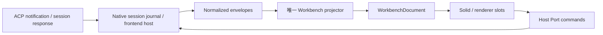

# Pylon 模块维护地图

本页说明当前源码的责任边界，不是将来必须照着搬目录的施工计划。术语见 [CONTEXT](../../CONTEXT.md)，命名与模块规则见 [开发规范](../../.agents/dev-standards.md)。目录清单的可执行来源是 [audit-maintenance.mts](../../scripts/audit-maintenance.mts)；用 `bun run check:maintenance` 查看当前数量、未归属文件和大文件定位。数量随代码计算，不在文档复制。

## 责任与入口

| 维护块 | 路径与入口 | 所有者、输入输出与限制 | 验证入口 |
| --- | --- | --- | --- |
| 公开契约 | `src/contracts/`、`src/sdk/` | 定义插件可消费的类型、语义和版本边界；不拥有运行时状态 | SDK / manifest / contribution 测试；`check:immer` |
| 领域 | `src/domains/`；[workbenchProjector](../../src/domains/workbench/workbenchProjector.ts)（#486 项2 起四分：types/reducer/selectors/diagnostics 四件，本链接为公开面门面）| normalized envelope → 可丢弃文档；projector 保持唯一，选择器不改 journal；`timeline.data` 是**标量身份面**（tool/activity 两族按长度收窄：≤512 短标量 + 一层内嵌短标量，省略键名记入 `payloadKeys`），载荷的唯一承载面是 `document.activities[]`，契约见渲染引擎唯一入口台账 **K20**，逃生口 `data-timeline-payload="full"`（运维开关，插件不得依赖） | `vitest run src/domains` |
| 应用装配 | `src/app/`、`src/application/`、`src/kernel/`；[applicationRuntime](../../src/application/applicationRuntime.ts) | application 层拥有应用注册和事务；kernel 负责根挂载、恢复与启动接线；`app/startupTiming.ts` 是启动相位打点（#269，release 可用旁路，ready 时一次性上报，权威出口在后端 runtime log） | `vitest run src/kernel src/application` |
| 基础设施 | `src/infrastructure/`；[runtimeClient](../../src/infrastructure/tauri/runtimeClient.ts) | UI / domain 边界到 IPC、存储、传输；处理错误和取消，不决定产品布局。#488 批⑦：前端诊断日志统一出口 `tauri/frontendLogSink.ts`（实现）+ `src/contracts/frontendLogSink.ts`（端口，#489 分层门禁起自 domains 上移 contracts）——接后端 `push_frontend_log`，失败静默降级回 console，main.solid.tsx 顶部接线（#515 入口改名） | `vitest run src/infrastructure`；`check:boundaries` |
| 插件宿主 | `src/plugin-runtime/`；[pluginCompositionRoot](../../src/plugin-runtime/pluginCompositionRoot.ts) | 拥有 registry、activation、权限与资源 Scope；产品通过贡献接入 | `vitest run src/plugin-runtime` |
| 第一方产品 | `src/plugins/`；[builtinProductPlugins](../../src/plugins/product/builtinProductPlugins.ts) | 产品定义激活依赖，`plugins/core` 提供产品实现；不因 core 名称变成 Kernel。#485 划线（方案 C）：core 定性为**经插件机制交付的首方实现**——插件贡献面（贡献声明数据/注册入口，如 `BUILTIN_INTERFACE_MODES`）视图层必须走注册表消费，builtin 引用只允许住 `src/app/` 连接件（如 `interfaceModeLookup.ts`，registry 真值优先 + builtin 回退）；内部 API 面（契约常量与贡献产物读取端，如 `BUILTIN_TACTICAL_SCENE_SURFACE_ID`、`collectProfilePersona`、`FILE_SHEET_MAX_READ_BYTES`）按符号级白名单直连，清单唯一真源在 `scripts/check-product-contribution-boundary.mts` 的 `CORE_INTERNAL_API_ALLOWLIST`（who/why 逐条登记，新增豁免=显式评审动作；guard 管辖 App/components/sheets） | `vitest run src/plugins`；产品贡献/样式门禁（含 core 划线） |
| 工作台宿主 | `src/host/`、`src/application/agent-workbench/`（#486 项1 自 sheets/ 归位；原址仅留视图件）；[agentWorkbenchSession](../../src/application/agent-workbench/agentWorkbenchSession.ts)、[agentWorkbenchTurnClock](../../src/application/agent-workbench/agentWorkbenchTurnClock.ts) | 拥有会话绑定、generation、订阅和文档更新；renderer 经 Host Port 发命令。**活性权威单源**（ADR-0029 收口）：`kernel > clock > document`，一个 source 的全部回合事实（时钟 / 账本终态 / 内核在途标记与回合身份戳 / 仅时钟起点）集中在 `agentWorkbenchTurnClock` 的一条 per-source 记录里，所有写入者共用同一组守卫（内核让位 + 读新鲜度）；「**本回合**是否已收敛」只能用回合作用域的 `latestTurnBoundary`（`canonicalTurnDuration.ts`）判定——回合无关的 `hasCanonicalTurnTerminal`（「历史上出现过终态」）不得用于封存时钟/补终态摘要，否则切页或重读会把在途回合压成上一轮的 `displayOnly` 摘要（#390） | `vitest run src/host src/application/agent-workbench` |
| 渲染器 | `src/renderers/`；[SolidWorkbenchApp](../../src/renderers/solid-workbench/SolidWorkbenchApp.solid.tsx) | 消费 document / appearance / commands；拥有局部 UI 与 DOM 清理，不另建会话数据源 | `vitest run src/renderers`；`check:solid`；实际 UI 检验 |
| 工作区 UI | `src/sheets/`、`src/workspace-sheets/`、`src/components/` | Sheet 激活、设置与已有组件；agent-workbench 子目录优先归宿主块。chat 含历史编排，迁移前逐个核实 | 对应组件/Sheet 测试；`check:first-party-styles` |
| CLI | `src/cli/` | 语法和执行适配，复用命令责任方，不重建 session 生命周期 | `vitest run src/cli` |
| 观测 | `src/devtools/obs/` | 冷启动、删除取证、stderr 样本、三源导出与 typography 基线 DEV 触发器；只读证据，触发器在 main 动态接入（原 `src/obs04~07` 四个顶级散目录，结构全修批收敛为单目录，安装样板抽 `devTriggerKit.ts`；#520 K 域起原 `src/css01/` 取证件并入本目录——`typographyBaselineTrigger.ts`，其基线工件组装迁 `src/domains/theme/typographyBaseline.ts`）。#228 起三源采集器下沉 `src/domains/export/`（生产 `core.export.*` 与 DEV 钩子同源） | `vitest run src/domains/export src/devtools/obs` |
| 窄工具 / 演示 | `src/utils/`、`src/demo/` | 窄工具按消费者归属；demo 数据不能当真实 Agent 结果 | 对应工具测试；生产 bundle 检查 |
| 前端根文件 | `src/*` 的直接文件（main/App/index.css/声明文件）；主题/预设集群已整体落位 `src/domains/theme/`（结构全修批：`store.ts`→`themeStore.ts`、`themeTypes.ts`、themeFieldDefs、customPresets、themePresetState、tokenFormat、`presets/`、`zones/`，themeFieldRenderer→`components/settings/`） | 入口文件继续按 #351 口径不吸收新增子目录；主题域文件随 `src/domains/theme/` 维护，`ThemeSettings` 单源在 `themeTypes.ts`（灭 store⇄defs⇄presets 类型环） | `lint`、`build` 与消费者测试 |
| 测试支撑 | `src/test-utils/` | mock 形状与 fixture 工厂（如 `tauriCoreMock.ts`）；仅测试代码消费，不进生产构建 | `lint` 与消费它的套件 |
| Native ACP | `src-tauri/pylon-acp/src/`（引擎核）+ `src-tauri/src/acp/`、`dispatcher/`、`lifecycle/`（宿主适配） | #247 起协议引擎核（engine/{mod,inbound,outbound,prompt_wait}（#416 拆分）、client、negotiated、replay、wire_trace、policies、interaction_queue、adapter/{permission_wire}——provider 方言信封 private_ext 与私有交互超时裁决 interaction_bridge 已随 #424 迁宿主 src-tauri/src/protocol_adapter/；spawn 入口在 process.rs）独立 crate，结构化日志经 `runtime_sink` 端口注入；宿主侧保留实例注册与 harness 表征测试（#424 起 protocol_adapter 域 = method 表 per-provider 槽单一注册面 + private_ext/interaction_bridge 方言件，catalog 诊断自注册表反向投影），传输、协商、通知路由、实例连接；lifecycle 锁序与 generation 保持一个入口。#423 起审批线三 store（queue + pending_permissions + private_interactions）的写路径收口宿主 `src-tauri/src/interaction_ledger.rs` 单一登记面（挂 `AgentRuntime.ledger`：admit/settle/restore/drain_disconnected 单点，超时 sweep 合一 `sweep_interaction_timeouts` 且 deadline 归队列权威；`interaction_list` 读 queue snapshot 输出 wire 形状，CLI 侧 normalize 重建）。#98 起：`acp/negotiated.rs` 是能力协商快照唯一真源（canonical 矩阵 + 四态 + 消费者注册表，session 建立/重连探针/agent_status 消费同一份；快照构造经宿主 `acp/mod.rs` 共享辅助 `negotiated_snapshot_from_client`，async / try_read 同步双入口保留（#549/ADR-0037 起内部为 acp 单元短窗快照读，锁内无 await；单元本体 `Arc<RwLock<Arc<AcpClient>>>`）——#416；#110 F2：`list`/`close`/`delete`（#398）为**双形状**——ACP 标准的 object 与线上旧广告的显式 `true` 都算广告，其它值仍 fail-closed），`acp/interaction_queue.rs` 是 permission/elicitation/question 等 client request 的统一 request-id 队列（FIFO、单一 Active、cancel/timeout/disconnect drain 终态、冷挂载快照；#423 起 deadline 归队列权威——超时判定接线 `drain_expired`（`now > deadline` 严格边界）由宿主 `InteractionLedger` 超时 sweep 单点调用，`pending_interactions_wire` 投影带 provider/deadlineMs 作为 interaction_list/agent_status 共同快照面），`session/fork.rs` 是 `session/fork` raw RPC 消费者（能力 usable gate + 受限 envelope + parent/child 登记），`session/control.rs::agent_session_delete` 是 `session/delete` 消费者（#398：删除链路在 close 之后 best-effort 清 agent 侧持久记录——显式 periId 按 agentId 路由（不查 runtime 映射）、usable gate、-32601/stale generation 降级 skipped，agent 支持却失败才上抛） | Rust ACP / dispatcher / lifecycle 测试；`check:acp-shadow`；#316 宿主 fs/terminal 双门控（`host_tools.rs` `HostToolsPolicy::resolve` 是广告与门禁**单一解析源**，`initialize_plan::build_initialize_plan` 消费同一结论注入/裁剪 initialize 广告）+ elicitation 标准 form（广告 `{form:{}}`、`AcpKind::ElicitationComplete` 收敛、GUI 表单卡 `ElicitationRequestCard`）+ `classify_session_update`（SessionUpdate typed-first + 宽容别名 fallback 的变体分类唯一入口）+ stopReason/protocolVersion 官方判定（`prompt_stop_outcome`/`validate_protocol_version`）；strict fs 沙箱根权威归会话工作区（SessionInfo.cwd），不取 agent 自报参数；#348/#349 起：崩溃控制帧单一构造点 `crash_control_frame` + 传输失败分类 `transport_failure_reason`（干净关闭 = 子侧传输 future 返回 `Ok`，不发帧；`Some` 臂只覆盖非 EOF 物理 IO 错误）、`SUPPORTED_PROTOCOL_VERSIONS` 只接受 v1（fail-closed，拒绝发生在发出 `initialize` 之前的计划层）、子进程启动卫生收口（#361/#363：控制台窗口隐藏下沉 `pylon_foundations::child_command::HideConsoleWindow` 并覆盖全仓生产 spawn——发行构建自 #361 起是 GUI 子系统，漏一处就闪一个黑框；`process::configure_agent_child` 再叠加 UTF-8 环境四项，`process::spawn_retrying_exec_busy` 对 `ETXTBSY` 在 1 秒预算内指数退避重试、非 busy 错误一次即返）；revive 的 `session/load` 与 `session/persist` 同构走 replay capture（预插 `replay_loading` 槽 → `begin_replay_capture` → 回放内容丢弃，journal 仍是唯一 durable 权威）；#354 起 `fs_policy::FsFailure` 三分类是宿主 fs/terminal 负路径的唯一 wire 映射源（dispatcher 纯函数：NotFound→-32002+`data:{uri}`、SandboxDenied→-32602+`sandbox:` 前缀、其余→-32602 裸消息），`rpc_failure_details::AuthRequired`（-32000 结构化判定）经 initialize 映射为稳定码 `agent_auth_required`；#352 起：`wait_prompt_with_recovery` 增 `cancel_requested` 一等判死输入——命中绕开闲置/首 token 评估直接进 cancel-settle 窗口，`PromptTimeoutKind` 增 `UserCancel`（`user-cancel`，settle detail `triggered_by:user-cancel`），cancel 后 agent 持续产出刷新 liveness 不再能推迟收敛；#353 起 `windows_launch.rs` 是 plan→Command 构造的唯一口（spawn 期 Windows 特调的绕行/裸名解析都在此，`hide_console_window` 仍归 `process.rs`、在构造之外应用）（`.cmd`/`.bat` 绝对路径 ∧ UNC cwd 改走 `%SystemRoot%\System32\cmd.exe /d /s /c "pushd … && …"` 绕行——批启动器经 cmd.exe 时 UNC cwd 会被静默换成 `C:\Windows`——并做防注入批行 quoting；spawn 期裸名按 `.exe→.cmd→.bat` 扩展优先序在 PATH 增补；条件不满足时与直启逐字节一致）；revive 的 `session/load` 与 `session/persist` 同构走 replay capture（预插 `replay_loading` 槽 → `begin_replay_capture` → 回放内容丢弃，journal 仍是唯一 durable 权威）；#352 起：`wait_prompt_with_recovery` 增 `cancel_requested` 一等判死输入——命中绕开闲置/首 token 评估直接进 cancel-settle 窗口，`PromptTimeoutKind` 增 `UserCancel`（`user-cancel`，settle detail `triggered_by:user-cancel`），cancel 后 agent 持续产出刷新 liveness 不再能推迟收敛 |
| Native session | `src-tauri/pylon-session/src/`（存储核）+ `src-tauri/src/session/`（命令编排） | #247 起存储核（event_repo/msg_repo/retention/turn_rollup/user_data/persistence_bootstrap，`SessionError` 错误域）独立 crate，结构性禁止触达 tauri；宿主 session 事务、journal 与 replay（#416 起 prompt 编排拆 `prompt/{mod,ingest,ledger,wait,settle,hooks}`，finalize 双臂合一、load 臂 helper 共享、`LAST_IN_PLACE_VERSION` 显式化）；持久化提交先于发布，删除 tombstone 阻止复活（#110 F3：删除在写 tombstone 的同一事务内清扫该 owner 的 canonical 事件；遗留垃圾由墓碑清扫 + WAL checkpoint 的后台维护兜底；#110 F5：建立期按「agent 显式 model > profile.model > 响应回显」落 `session.model-updated`）。#324 起：用户主动停止（prompt 响应 `stopReason=cancelled`）由 `session/prompt/settle.rs` `finalize_response` 在 #316 闭式表之前拦截、改走 done 通道中性结算（账本 Cancelled 终因与 #99 settle 不变；`protocol.rs` 闭式表契约不动；前端 `agentWorkbenchSession` 终态映射 + `GenerationFooter` reason='cancelled' 「已停止」呈现）。#363-4 起：`session/expiry.rs` 的后台回收**不再按来源放行**（原 `is_platform_source` 守卫使 GUI local 永不被回收），改为按活跃信号豁免（在途回合 / 在场交互 / prompt 闸门 / prompt 锁），并在「零会话且闲置超时」时走 `lifecycle::stop_agent_runtime` 释放 agent 子进程；超时可配 `PYLON_SESSION_IDLE_TIMEOUT_SECS`（#490 起默认 `0` 关闭——#379 懒重连使自动回收失去必要性，设正秒数为资源受限场景的显式 opt-in） | Rust session / event_repo / replay 测试。#352 起：用户 cancel 判死输入载体 `SessionInfo.cancel_requested`（键化 generation，进程内事实不落 wire）——`cancel_prompt` 发送成功 + generation/session 复核后 `mark_cancel_requested` 置位（锁中毒按错误边界 map_err 入域，不静默跳过），回合起点经 `clear_cancel_requested_for_new_turn` 清除（与账本 begin 同点）；#420/ADR-0034 起「在途回合」事实由 `turn_ledger.active` 单源承载（`turn_in_flight`/`settle_active_for_session`/`stale_active_for_session` 三个查询/结算口，SessionInfo 不再镜像），判死探针 `prompt/ledger.rs` `cancel_requested_probe` 只认本代际置位（锁形态 #331 例外二 into_inner） |
| Native host | `src-tauri/src/` 其余模块 | Tauri 命令注册、文件/终端/Gateway/安装等 native adapters；专业子目录优先归属；`startup_timing.rs` 是进程启动相位表（#269，t0=main 首行，`report_startup_timing` 合并前后端相位出一条 source="startup" 日志）；`logging/` 是崩溃取证的落盘链（#362：`file_sink` 每日轮转 + 每日 512 MiB 上限且从当日既有文件尺寸续算、`budget` 预算状态机、`panic_hook` 同步写盘的 panic 记录、`throttle` 前缘节流）——日志目录由 `paths::resolve_log_root` 在 `main()` 的 `init_tracing` 阶段解析（早于 Tauri `setup()`）。#482 起 `paths.rs` 是**便携唯一存储模式**：数据/配置根 = `<exe_dir>/data/`（不可写即启动致命失败，AppData 回退与 AppData→portable 迁移链已整体退役），DataDirs 只剩 data_root/config_root 两字段 | host 库测试、构建与 Clippy |
| 可复用 Agent 能力 | `src-tauri/pylon-core/src/` | catalog、检测（#416 起 `agent_detection/` 子模块目录）、preflight、launch plan、AgentDef 值类型（`agent_config`）、hermes 启动适配、correlation 身份契约、provider_adapter 投影、`node_path`、`fnv1a`（#416 收编哈希实现）、宿主侧预算常量归口 `src-tauri/src/lifecycle/budgets.rs`（TotalDeadline/StageBudget/Ttl 三形状，#416）（#363-3：启动最早期探测 9 种 node 版本管理器的 bin 目录并在 node 不在 PATH 时前插，只在缺 node 时动手）；保持受控探测与配置身份区分 | workspace 化后随 `cargo test --workspace --lib` 进门禁；Clippy 走 workspace 单跑 |
| Native 基础 / 宠物 | `src-tauri/pylon-foundations/src/`、`src-tauri/pet-core/src/` | 基础类型与独立宠物领域；不从 renderer 或 Tauri UI 反向导入 | 同上（单锁单 target，`--workspace` 一条命令覆盖全 crate） |
| canonical 契约单源 | `src-tauri/pylon-canonical-types/src/` | canonical 事件类型词表、wire 判别符映射与 identity 推导（owner key / eventId / sequence）。**唯一事实源**：TS 侧词表由 `scripts/generate-canonical-event-types.mjs` 从它生成，写入侧 `pylon-session/src/event_repo/` 与计算核同时消费（#220 WP1，ADR-0018） | `cargo test --workspace --lib`；`check:canonical-types`（TS 生成物是否同步） |
| 保留策略契约单源 | `src-tauri/pylon-session/src/retention.rs` | 保留策略档位/默认值（TIME_DAYS_TIERS / COUNT_LIMIT_TIERS / DEFAULT_*）。**唯一事实源**：TS 侧常量由 `scripts/generate-retention-policy.mjs` 从它生成到 `historyRetentionPolicy.contract.ts`，`historyRetentionPolicy.ts` 只引入再导出并承担读取/校验/影响提示（#331/U3 裁决；此前为逐字双写无门禁） | `cargo test --workspace --lib`；`check:retention-policy`（TS 生成物是否同步，在 check:frontend 链内） |
| export 脱敏词表单源 | `src-tauri/pylon-foundations/src/sanitize.rs` 的 `is_export_sensitive_key` | export Strip 语义敏感 key 词表（exact 11 + token/apikey/api_key 后缀 + secret contains）。**唯一事实源**：TS 侧由 `scripts/generate-export-sanitize-vocabulary.mjs` 生成到 `canonicalExportSanitizeVocabulary.generated.ts`，`threeSourceExport.ts::isSensitiveExportKey` 消费生成物做规则组合；值正则有意不生成（Rust regex ↔ JS 方言差异），字面量一致性由 `scripts/sanitize-vocabulary.test.mts` JS 重放门禁看守（#444）。同文件 `redact_absolute_path` 逐行为镜像前端 `redactAbsolutePath`（两侧同期望值单测互钉），`export_session` 在 sanitize 后接 `redact_export_absolute_paths` 做绝对路径收窄，与前端取证导出脱敏强度对齐 | `cargo test --workspace --lib`；`check:export-sanitize-vocabulary`（TS 生成物是否同步，在 check:frontend 链内）；`bun run test`（parity 门禁） |
| 跨 await 锁卫单源 | `src-tauri/pylon-foundations/src/await_guard.rs` 的 `HeldAcrossAwait` | #488 批②：有意跨 `.await` 持锁的唯一收口类型（newtype Deref 透传、无 Drop 实现，锁获取/释放时序零变化；clippy.toml 禁 tokio 锁卫裸跨 await 的显式 opt-in 面）。使用纪律：每处保留锁序注释（锁名 + 为什么串行化是语义）；`#[allow(clippy::await_holding_invalid_type)]` 裸写法全仓禁止 | `bun run check:clippy`（链尾 `scripts/check-await-holding.mjs`：禁裸 allow + 使用点对 INVENTORY 清单对账，CI rust-clippy 同步执行） |
| 前端计算核（WASM，**2026-09-21 起只剩流式**） | `src-tauri/pylon-compute/src/streaming/` | 流式文本管线（stable/unstable 切分、揭示预算引擎 D1/D2）的**计算层**，`wasm-bindgen` 出口。纯函数：不读时钟/store/registry、不做 IO、不发明活性判定（权威在运行时内核，ADR-0017）。出口分「纯内层 + wasm 薄壳」两层（`JsError` 在非 wasm 目标会 panic）。**投影与 events 的 Rust 侧已删、回退 TS**（ADR-0018）：投影在 `src/domains/workbench/workbenchProjector.ts`（活实现），events 一直就在前端 TS（`src/domains/events/**`、`infrastructure/events/canonicalEventBatch.ts`）。产品路径的编排与 DOM 消费仍在 JS，`src/wasm/` 是构建产物 | `cargo test --workspace --lib`、`check:rust`；**等价性**对照见 `scripts/compute-parity/`（parity 门禁，只对流式两项）；**性能**读数见 `scripts/perf-bench/`（`bun run perf-bench`，产品路径绝对成本；2026-09-22 起取代已废除的 wasm↔TS 比值跑器；**内存**读数见同目录 memory 域 `bun run perf-bench:memory`，比值判据 = 文档驻留/Σ逻辑载荷 ≤1.2×、拍数敏感性 ≤1.5×，#376/#375；#449 起补 live 投影（`reduceWorkbenchEvent(live)`，#440 的基线行）与 display-chain 两域（#441），memory 语料补 text/thinking 族——其驻留判据挂起待 M2 裁决（口径见 perf-bench README）；#567 起补会话口径（真实会话宿主 + 分页冷装载，驻留/拍敏同阈值，含 pending 模型）与 tool-run 折叠收益样本（读数见 perf-bench README 与 .agents/records/567-*））；markdown 回归见 `markdownComputeParity.test.ts` 的快照锁 |
| markdown 解析（WASM） | `src-tauri/pylon-markdown/src/` | comrak（GFM + math_dollars/footnotes，#267）解析 → 与 TS `MarkdownRenderNode` 同形状的渲染模型，**整块进/整块（行数组）出**。**代码高亮自 2026-09-22 起不在本 crate**（#241，ADR-0020）：原 syntect 语法机器 + 14 份 vendored tmLanguage 语法（`assets/`，由 `gen/generate-assets.mjs` 从 starry-night 导出）编译后常驻 wasm 线性内存且**只涨不落**（#240 实测占渲染器可控内存 ~30%），整条退役，改为前端 Lezer（`src/domains/chat/lezerHighlight.ts`，应用内文件编辑器同一套引擎）。不含 DOM 与缓存编排（那些留 JS：`renderers/solid-workbench/chat/markdownRenderModel.ts` 解析缓存/graft、`renderers/solid-workbench/chat/codeBlockDomLifecycle.ts` 高亮 DOM 生命周期——视口门控、圈外降级+行缓存、帧预算调度，#221） | `cargo test -p pylon-markdown --lib`；`parity/` 只剩语料与 Rust 快照（126 条，含 #267 数学/脚注用例，供 `markdownComputeParity.test.ts`） |
| 测试夹具 crate | `src-tauri/pylon-fake-agent/src/` | 测试专用假 ACP agent（stdin/stdout JSON-RPC、`--scenario` 旗标路由、确定性输出）；feature `test-agent` 门控，不随发行包发布、不参与生产运行时。#382 起独立 member crate——此前是主 crate 的 `[[bin]]`，而 Cargo 的"包内 bin 隐式链接本包 lib"规则会让编一个 2100 行夹具连带编译整棵 Tauri 依赖树（CI 实测 405 crate / 5m26s）。依赖只有 `serde_json`，其 `preserve_order` 是 wire 字节序契约（golden trace 逐字节基线），不要删 | `cargo test -p pylon-fake-agent --features test-agent`；`check:acp-shadow`；`cargo test --workspace --tests --features test-agent` |
| 构建与工具 | `src-tauri/*` 的构建文件、`scripts/` | 开发、审计、打包工具；不是产品运行时依赖 | 脚本测试、发行校验、`check:docs` |

`check:maintenance` 覆盖上述根下受 Git 管理或未忽略的新 TS/JS（含 m/c 变体）、Rust、Python、PowerShell、shell 源文件；排除 tests、fixtures、vendor、target、node_modules、声明文件与打包资源。CSS、图片、配置及文档不是该源码计数的对象，分别由样式、主题、manifest、bundle 和文档门禁维护。Rust 行数包含内联单测，只能用于定位；不能由行数断言生产复杂度。资源 SDK 是构建产物，不能当作第二份可编辑实现。

新增目录的归属在 `moduleDefinitions` 显式登记；未知前端子目录会导致检查失败。该清单按目录责任归类，**不能替代 import 依赖检查**，后者仍由现有 runtime / renderer / contribution 门禁负责。

## 会话与渲染边界

图是责任流，不表示每个响应都写入 native journal。session response 的补充投影和浏览器旧消息桥接有各自来源与信任级别，不能借重构升级为 authoritative replay。

当前已分开的责任：

- [sessionResponseProjection](../../src/application/agent-workbench/sessionResponseProjection.ts)：响应选项、模型/模式与 envelope 值转换（#304：存在标准 configOptions 时不再合成 legacy model/mode 候选；事件 id 含 sequence，kind 区分会话建立与选择器更新）。去重（只与**最近一条**响应 + 当时 session 快照比对，故 A→B→A 不被永久吞掉）、session owner、订阅与顺序留在 host。
- [messageSnapshotProjection](../../src/application/agent-workbench/messageSnapshotProjection.ts)：旧消息快照转换。调用者负责读取存储；转换不提升历史数据的权威性。
- [toolConnectorProjection](../../src/renderers/solid-workbench/toolConnectorProjection.ts)：连线身份、legacy 优先去重与 appearance 解析。布局测量、DOM 注册和卸载留在挂载组件。
- [interactionProjection](../../src/domains/workbench/interactionProjection.ts)：interaction 的脱敏与终态保留策略。类型引用不引入反向运行时依赖，事件次序/去重仍由父 projector 管理。

### 「呈现」四域边界与碎域归属（#486 项7）

四个名字都带「呈现」味的域，边界按「管什么状态」切分：

- **presentation**——用户对**呈现档案**的偏好（选哪套 presentation profile，单一持久化 store；#515 批0 起 zustand 已退役、内核为 solid-js/store）。消费者是设置页、agent-workbench 宿主与 core/renderer 的偏好读取。
- **appearance**——**外观运行时**的组合与派生（cc 布局、spinner 资产/动词、由 ThemeSettings 派生的外观状态、侧栏模块偏好与 settings chrome store）。它不存「偏好选了什么」之外的语义，视觉结果的组装在这里。
- **rendererContent**——**内容 → 渲染语义**的归一契约层：各内容族 render kind catalog（text/tool/session/execution/interaction，kind 是内容契约、不等同 renderer 实现，A07）+ 内容呈现纯函数（file/reasoning 呈现、媒体源解析）+ 对统一 Renderer Registry 的产品查询门面。它不做 UI，也不持有偏好。
- **interface**——**界面布局模式**的偏好与状态（interface mode，单一持久化 store；#515 批0 起 zustand 已退役、内核为 solid-js/store），跨 workspace-sheets / settings / shell 消费。

一句话：presentation 管偏好档案、appearance 管外观组合、rendererContent 管内容语义归一、interface 管布局模式；四域均不直连 IPC（传输面在 infrastructure），偏好持久化的 wire 形状变更视为公开契约变更。

碎域归并结论（≤4 文件域逐个核实生产消费者后的裁决）：

- `fileDispatch` → **已并入 `file`**（dispatchMessage/fileDiff 两件的消费者全部在 sheets/file，#486 项7）。
- 保留的小域（消费者跨簇，小而内聚不是债）：pluginData（identity ×4 + plugin-runtime/sessionData ×1）、inputPrediction（renderers/infrastructure/settings 三簇）、runtime/runtimeStore（29 消费者）、search、session、tasks、overview、browser、export、interface、presentation。
- attachment / binding / feature：**生产代码零消费者**（仅 p3RoutingRegression 回归测试触 binding；feature 连测试引用都为零）——「按消费者归并」对无消费者域不适用，属死代码候选，留卫生批裁决，本批不动。

## 判断是否需要继续拆分

| 已核验的现状 | 维护判断 |
| --- | --- |
| `kernel/applicationRuntime*` 的 deprecated 转发已于 2026-09-13 删除：`src/kernel/` 只剩根挂载/恢复组件与启动接线，测试直接依赖 `src/application/applicationRuntime.ts` | 该维护判断已执行完毕；保持单一 application 入口，不再产生第二转发层 |
| `lifecycle/mod.rs` 的后半部为内联测试，连接/切换/重连通过 `do_connect_and_replace` 共享锁序 | 不为缩短文件搬动锁和并发流程；后续行为变更与对应 characterization 测试一起处理；#416 起命令层/纯读块可拆（summary/registry/session_probe/stop），锁序文档与 `do_connect_and_replace` 本体必须留 mod.rs |
| `dispatcher/` 已有 `routing`、`canonical_flush`、`crash_reconnect`、`interaction_route`、`host_tools_gate`、`permission_route`、`fallback_route`、`publish_route`、`reactions`（#416：会话更新选路收口与 pet 订阅 sink）缝模块（#317 批次二）；宠物事件在 sessions 锁内收集、锁外按序应用。#336/U2b：主泵 `start_notification_dispatcher` 为编排入口（复位+装配+spawn），循环骨架在 `NotificationPump::{new,run,pump_step,route_frame}`——分支各一行模块调用，`route_frame` 的 return true/false 精确映射原 continue/break；flush 环境经 `flush_context()` 现场构造（#335 `CanonicalFlushContext` 字段清单唯一处）。#334：逐帧热路径 payload 经 `Arc<Value>` 共享进 ingest（ingest 先、publish 后取回唯一引用），reducer 走 `AcpSessionState::apply_session_update` 零拷贝入口，`turn_ledger` 拆 active/terminal 双表（单 Mutex）后 `note_session_activity` 只扫 active 表 | 继续拆块必须保持锁外副作用时序；路由顺序与锁持有范围不得随重构改变（对照基准 = `route_frame` 分支次序与 `pump_step` biased 优先级） |
| OBS 04—07 的采集对象、trace 包装与返回 API 不同 | 不把相似安装守卫抽成泛用全局注册器；保留 DEV 隔离和各自证据语义 |
| 根 store 已随 #351 下沉各域（identity 经 `app/ports/identityCrossDomainPort` 单向装配）；plugins/renderers 仍有 10 个 global store import 在 legacy 白名单 | 白名单仅报告存量消费点；不能通过新增豁免宣称模块化完成 |
| 视图目录仍住 store/controller 存量：`src/sheets/tacticalSceneStore.ts`（持久化偏好 store 居视图目录）、工作区控制器居视图目录（#520 结构审查 S2-P2 登记） | 已认知的存量债：归属随对应域收敛批裁决，不因目录位置单独搬动 |

## 验证

`bun scripts/audit-maintenance.mts --naming` 额外输出生产 TS 绑定命名发现；它复用 ESLint 配置，不维护第二套规则。`bun run lint` 是包含测试代码的命名门禁。Rust casing 由 Rust lint 维护，语义名与单位仍需 code review。

整体入口是 `check:frontend` 与 `check:solid`——#179 起 `check:solid` 同入 CI 前端 job，本地与远端同一套边界门禁——再加上当前 CI 的 Rust 测试 / ACP shadow parity / workspace 单跑 Clippy。#184 起 CI 拆为多并行 job；#193 起为 frontend（静态门禁 `check:frontend:static` + main 专用覆盖率）/ frontend-test（vitest `--shard` 分片矩阵）/ rust-test / rust-clippy / rust-shadow 五个 job：`check:frontend` 本地语义保留（含测试），CI 上 vitest 走 frontend-test 分片（650+ 个测试文件，数量随代码计算，对半并行），覆盖率门禁只在 main push 执行（阈值仍拦住合入后的 main）；Tauri core mock 统一走 `src/test-utils/tauriCoreMock.ts` 工厂（形状单一来源，行为仍 per-file）；#193 曾试点 react-shared 组 jsdom 环境共享（`isolate: false`），因实测收益微小（environment 累计仅降 ~16s）且与隔离组时序敏感测试的抖动相关而**回退**——DOM 套件维持 per-file 隔离；`check:acp-shadow` 与 golden trace generator 的 cargo 调用统一 `--features test-agent` 指纹；构建配置 `.cargo/config.toml`（rust-lld + line-tables-only）自 #399 起置于**仓库根**——cargo 的配置发现按 cwd 逐级向上，原先放在 `src-tauri/.cargo/` 时从仓库根以 `--manifest-path` 发起的调用读不到它，两种写法会分裂成两套 rustc flag 集、写同一批产物而互相作废（同一 target 目录交替调用整图重编）；#401 起 `check:acp-shadow` 一步只用**一种** cargo 形态（背压探针与 fixture 共用 `-p pylon -p pylon-acp --lib --features test-agent` 选择，两条探针测试名合并为一次调用），且 golden trace 的两轮产出由 generator `--check` 生成、parity 直接复用（fixture 执行 4→2、cargo 调用 6→3）；dev 调试信息口径同样以 `.cargo/config.toml` 为唯一真源（CI 不再注入 `CARGO_PROFILE_DEV_DEBUG`）；`check:maintenance` 已接入 `check:docs`，随前端 CI 执行。#414 起 clippy 另带两层静态配置：仓库根 `clippy.toml`（`await-holding-invalid-types` 禁 tokio 锁卫跨 await）与 `src-tauri/Cargo.toml` 的 `[workspace.lints]`（`redundant_clone` 提编），全部 member crate 经 `[lints] workspace = true` 接入，执行语义不变（相对基线零新增）；#488 批② 起 clippy.toml 六条目另带 `allow-invalid = true`（无 tokio 依赖图的 crate 不发「类型不可达」元告警，lint 本体不变），且 `check:clippy` 链尾随 `scripts/check-await-holding.mjs`（有意跨 await 的锁卫经 `pylon-foundations/src/await_guard.rs` 的 `HeldAcrossAwait` 收口并登记对账清单，裸 allow 全仓禁止），CI rust-clippy job 同步执行；规范条目见 dev-standards「Rust 性能卫生静态门禁」。#489 起 `scripts/check-layer-boundaries.mts` 分层规则表从 4 条扩到 11 条：infrastructure 不得 import domains 的运行时值（type-only 边豁免）、kernel 只能被 app 挂载（domains/视图层禁引 kernel；kernel 自身出向按 bootstrap 装配语义逐条豁免）、domains 不得依赖 host/app/cli/application、cli/application/app 不得 import 视图层；存量违规全部以带理由的边级豁免表登记（豁免带陈旧检测，违规边消失须删条），明示不设防的方向清单见该脚本头注。#469 起 CI 再带簿记改动面路由：新增 `changes` 作业（`判定改动面`）按**正向白名单**判定「本次改动是否只碰簿记类文件」，名单仅 `AGENTS.md`、`README.md`、`.agents/L.md`、`.agents/BOARD.md` 与 `.agents/{records,decisions,spec,templates}/**`（`docs/说明书/**`、`CONTEXT.md`、`.agents/dev-standards.md` 是门禁输入，不在名单），判真时五个重活（frontend / frontend-test / rust-test / rust-clippy / rust-shadow）按作业级 `if` 整体 skipped，文件末尾 `ci-gate`（`门禁总闸`）以 `if: always()` 恒有产出并汇总六项结果（failure/cancelled 即失败，skipped 按不适用处理），main 的 ruleset 必需检查随之收敛为 `门禁总闸` 一条。各阶段的测试日志和 CI 结果放在本次工作记录，避免把一次绿色运行写成永久保证。
